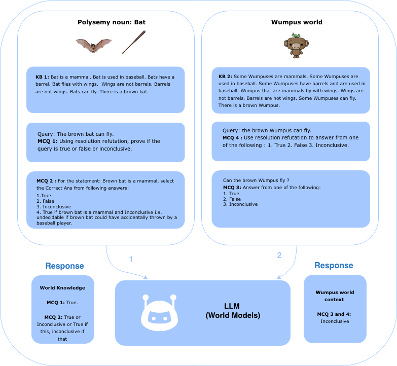

# A Proof-of-Concept Method for Logical Inconclusiveness-based Abstention

<a rel="license" href="http://creativecommons.org/licenses/by-nc-sa/4.0/"></a><br />This work is licensed under a <a rel="license" href="http://creativecommons.org/licenses/by-nc-sa/4.0/">Creative Commons Attribution-NonCommercial-ShareAlike 4.0 International License</a>.

## Overview
This repository introduces a methodology for evaluating **Logical Inconclusiveness** in Large Language Models (LLMs). The research focuses on "abstention"—the ability of a system to identify when a query cannot be definitively resolved as True or False due to under-specification or polysemy [1, 5].

### Motivation
Conventional logical methods, such as standard resolution refutation (RR) and skolemization decomposition, are often not meaning-preserving [5, 6]. This work explores how LLMs can tap into world knowledge and word sense disambiguation to identify incomplete but satisfiable (SAT) logical sets where traditional RR might fail or never terminate [1, 5].

## Research Development & Authorship History
[cite_start]This project represents the independent research of **Sushma Anand Akoju**[cite: 3, 35, 727, 1005, 1281]. The following timeline documents the evolution of this work during the Spring 2025 semester. [cite_start]The timestamps on primary research artifacts—often recorded during late-night and early-morning hours—reflect the intensive independent effort dedicated to this project[cite: 3, 40, 726, 1284, 1729].

| Date | Milestone / Document | Key Development |
| :--- | :--- | :--- |
| **March 11, 2025** | Initial Proposal [1] | [cite_start]Proposed measuring logical entailment in LLMs using Chain-of-Thought (CoT) prompting[cite: 3, 15]. |
| **March 31, 2025** | Revised Report (2:43 AM) [3] | [cite_start]Formulated the "Inconclusiveness" problem using polysemy nouns (e.g., Bat, Bark)[cite: 1004, 1012]. |
| **April 1, 2025** | Nite Report (12:43 AM) [4] | [cite_start]Documented manual conversion of FOL to Skolemized clausal forms to test "Meaning-Preservation"[cite: 1729, 1749]. |
| **May 8, 2025** | Final Revised Proposal [5] | [cite_start]Integrated motivation sections addressing decidability limits in Resolution Refutation[cite: 1284, 1296, 1302]. |
| **May 13, 2025** | Final Project Results [2] | [cite_start]Final evaluation across Claude 3.5, 3.7, and GPT-4o regarding ambiguity awareness[cite: 36, 40, 237]. |

---
### References
* **[1]** Akoju, S. A. "CS 830 Project Proposal." [cite_start]March 11, 2025[cite: 3].
* **[2]** Akoju, S. A. "CS 830 Project Project report & results." [cite_start]May 13, 2025[cite: 36].
* **[3]** Akoju, S. A. "CS 830 Project Proposal (2:43 AM)." [cite_start]Modified March 23–31, 2025[cite: 1003, 1004].
* **[4]** Akoju, S. A. "Project Proposal (12:43 AM)." [cite_start]Modified March 23, 2025[cite: 1729, 1730].
* **[5]** Akoju, S. A. "CS 830 Project Proposal & results." [cite_start]Modified May 8, 2025[cite: 1283, 1284].

## Methodology & Usage
The project utilizes a 16-step structured prompting procedure to generate "confusion datasets" based on polysemous nouns [2, 5].
            
## Licensing & Commercial Use
**Copyright © 2025 Sushma Anand Akoju. All rights reserved.**

This work is licensed for non-commercial use only. For licensing inquiries or permissions beyond the scope of this license, contact: sushma.ananda13@gmail.com. Note that inquiries related to use cases prior to April 2026 are subject to pre-existing legal restrictions. [Refer CODE_OF_CONDUCT.MD for more details.](https://github.com/sushmaanandakoju/logically-inconclusive-kbs/blob/main/CODE_OF_CONDUCT.md)

## Methodology & Dataset Generation
The project includes a 16-step structured prompting procedure to generate "confusion datasets" based on polysemous nouns.

### Update API keys

```
echo "GEMINI_API_KEY=your_gemini_api_key" > .env
echo "ANTHROPIC_API_KEY=your_anthropic_api_key" > .env
```

To generate examples:

```
uv sync
uv run --env-file .env -- python generate_data.py

OR

uv sync
uv run generate_data.py
```


<!-- </img> -->
